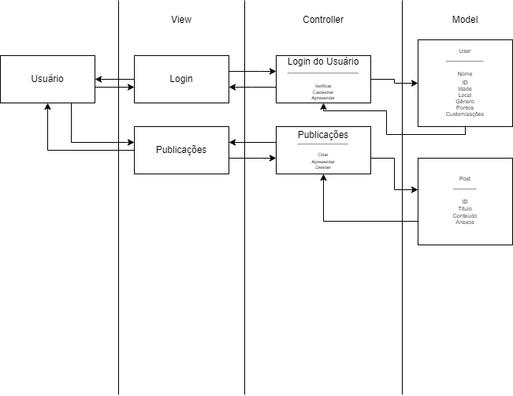

# Diagrama da Arquitetura

# Arquiterura MVC Projeto Sails
- Nome do Projeto: VTM
- Descrição: Plataforma de voluntariado unificada, com postagem de disponibilização para trabalhos
- Arquitetura: MVC (Model-View-Controller)
- Ferramenta de Diagramação: draw.io

### Modelos (Models):
- User
  - DB sobre dados do usuário, como nome, gênero, localização e roupas desbloqueadas para o carangueijo
- Post
  - DB para guardar postagens, com título, conteúdo, anexos e Id do usuário para reconhecimento

### Controladores (Controllers):
- Login do Usuário
  - Cadastrar: Entrada de nome, gênero, local, senha e email; Id gerado pelo sistema
  - Verificar: Entrada de email e senha, retorna Id do usuário e confirmação de login
  - Apresentar: Retorna todas as informações menos senha
- Publicações
  - Criar: Entrada de título, conteúdo, anexos pelo usuário, recebe UserID do cadastro, cria ID na database
  - Apresentar: Usa ID para retornar título, conteúdo, anexos e UserID

### Views (Views):
- Conta
  - Menu principal da conta. Apresenta tela de login caso não esteja cadastrado, ou informações da conta segundo função de Apresentar do controlador
- Publicações
  - Visualização de uma publicação, com informações fornecidas pelo Apresentar do controlador Publicações

### Infraestrutura:

- Para a visualização, está planejado utilizar o Bootstrap como única dependência visual para o projeto
- Database a partir do DBeaver

### Justificativa
Tentando manter a simplicidade do projeto como pedido pelos parceiros, sistema só armazena o mínimo de informações necessárias para o funcionamento das funções e cadastro.
#### Implicações da Arquitetura:
A solução, no momento do design, parece ser razoável, apresentando um nível bom de escalabilidade para um MVP. Deve ser facilmente mantido, mas não se pode ter certeza até escalar o produto
### Recursos Adicionais:
Documentação do Sails.js: https://github.com/balderdashy/sails
Tutorial do draw.io: https://m.youtube.com/watch?v=w3zm-wbmlpc
Exemplos de diagramas MVC: https://www.lucidchart.com/pages/templates